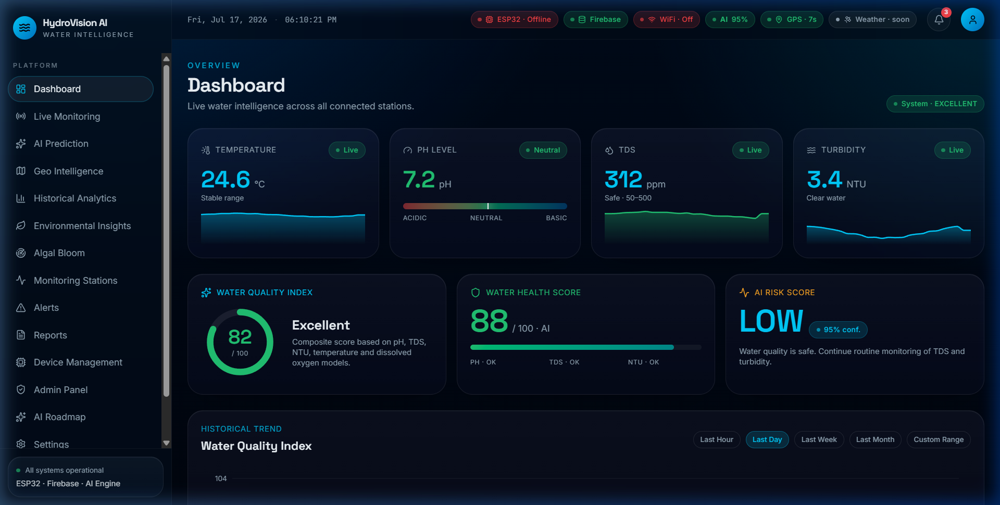
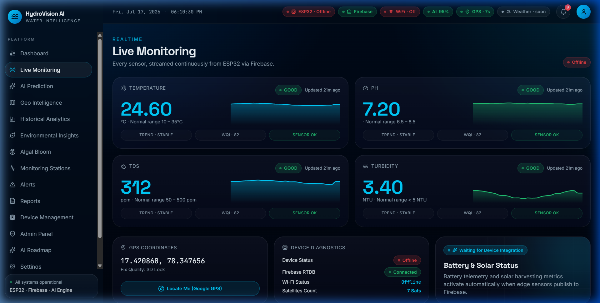
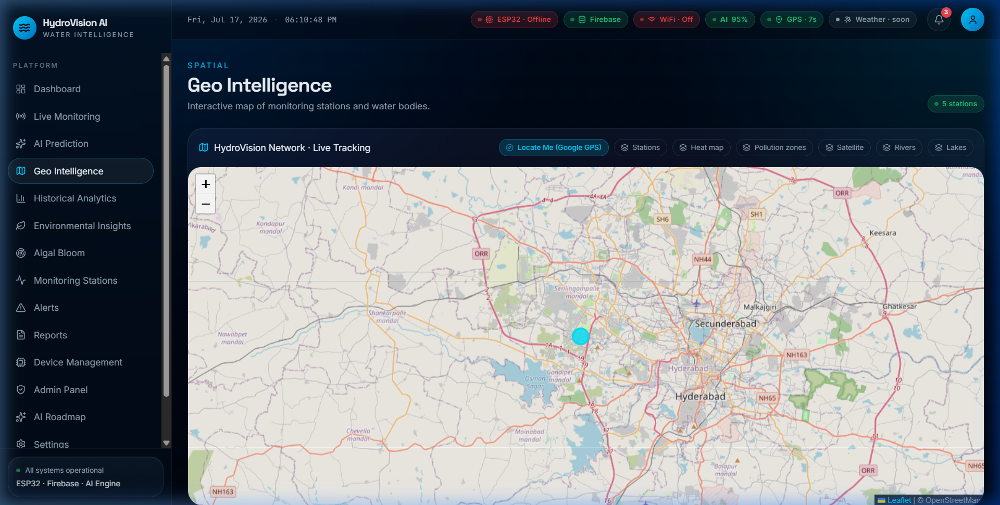

# HydroVision AI
### AI-Powered Smart Water Quality Monitoring & Environmental Intelligence Platform

[](https://www.espressif.com/)
[](https://www.arduino.cc/)
[](https://firebase.google.com/)
[](https://tinyml.org/)
[](https://react.dev/)

---

## 📖 Overview

**HydroVision AI** is an intelligent, end-to-end IoT platform engineered to monitor water quality across environmental water bodies such as lakes, rivers, reservoirs, fish farms, and drinking water sources. 

By combining embedded sensor acquisition, secure cloud synchronization, GPS spatial tracking, and a responsive glassmorphism web console, HydroVision AI ensures continuous monitoring, real-time alert triggers, and predictive telemetry. The codebase is fully structured to support edge inference models (TinyML) on local controllers for offline anomaly detection.

---

## 🏗 System Architecture

```
                    ┌──────────────┐
                    │ Water Source │
                    └──────┬───────┘
                           │
                           ▼
                    ┌──────────────┐
                    │   Sensors    │
                    └──────┬───────┘
                           │
                           ▼
                    ┌──────────────┐
                    │ Arduino UNO  │ (Sensor Controller)
                    └──────┬───────┘
                           │ UART (Serial)
                           ▼
                    ┌──────────────┐
                    │   ESP32-S3   │ (IoT Edge Gateway)
                    └──────┬───────┘
                           │ Wi-Fi Secure Link
                           ▼
              ┌──────────────────────────┐
              │ Firebase Cloud Database  │
              └────────────┬─────────────┘
                           │
                           ▼
                    ┌──────────────┐
                    │ Web Console  │ (React Dashboard)
                    └──────────────┘
```

---

## 🔧 Hardware & Interface Specifications

### Deployed Hardware List
| Component | Specification | Purpose |
| :--- | :--- | :--- |
| **ESP32-S3 DevKit** | Xtensa 32-bit LX7 Dual-Core | IoT Gateway, Secure Firebase client, GPS handler |
| **Arduino UNO** | ATmega328P 8-bit MCU | Low-level analog sensor sampling and filtering |
| **pH Sensor** | Analog pH Probe + Adapter | Acidity & alkalinity tracking (Range: 0–14 pH) |
| **TDS Sensor** | Gravity Analog TDS Sensor | Dissolved solids measurement (Range: 0–1000 ppm) |
| **Turbidity Sensor** | Analog Turbidity Sensor | Water clarity index (Range: 0–4000 NTU) |
| **DS18B20 Temp Probe**| 1-Wire Digital Thermometer | Precision water temperature (-55°C to +125°C) |
| **NEO-6M GPS** | NMEA-0183 standard receiver | Live location tracking & satellite synchronization |
| **SSD1306 OLED** | 0.96-inch 128x64 I2C display | Local status readout & diagnostic values |
| **Active Buzzer** | 5V Low trigger | High-severity environmental local alarm |

### Wiring Summary
* **Arduino UNO**:
  * `A0` ── Turbidity Sensor
  * `A1` ── Analog pH Probe
  * `A2` ── TDS Sensor
  * `D2` ── DS18B20 Temp Probe (1-Wire)
  * `D10` (TX) ── ESP32 Serial RX
  * `D11` (RX) ── ESP32 Serial TX
* **ESP32-S3**:
  * `GPIO8` (SDA) / `GPIO9` (SCL) ── OLED Display
  * `GPIO18` (RX) / `GPIO19` (TX) ── NEO-6M GPS Module
  * `GPIO2` ── Active Buzzer Control Pin

---

## 💻 Software Stack
* **Firmware / Embedded**: Arduino C++, TinyGPS++, Firebase ESP Client, ArduinoJson.
* **Database / Backend**: Firebase Realtime Database (RTDB), Firebase Anonymous Authentication.
* **Dashboard / Frontend**: React, Vite, TypeScript, Tailwind CSS, Recharts, React Leaflet (Map).

---

## 📊 Live Dashboard & Tracking

The HydroVision AI dashboard features premium glassmorphic UI design, real-time counters, responsive analytical charts, and historical reports.

### 1. Main Dashboard View
Displays real-time telemetry cards (Temperature, pH, TDS, Turbidity) mapped with live trends, along with composite WQI (Water Quality Index), Water Health, and AI Risk forecasting metrics.



### 2. Live Telemetry & Device Diagnostics
Track the operational state of your ESP32 IoT gateway. Displays real-time device diagnostic values, including Firebase connection status, Wi-Fi signal strength, GPS coordinate fix, and satellite tracking.



### 3. Spatial GPS Mapping
Integrates an interactive React Leaflet map that reads coordinates directly from Firebase `/current` and automatically pans/centers the marker as the device updates its location.



---

## ☁ Firebase Realtime Database Structure

The database maintains separate paths for current telemetry, historical aggregates, and alarm logging:

```json
{
  "current": {
    "temperature": 27.8,
    "ph": 7.12,
    "tds": 145,
    "ntu": 1.8,
    "wqi": 92,
    "state": "GOOD",
    "latitude": 12.9829,
    "longitude": 77.6197,
    "altitude": 920.4,
    "speed": 1.2,
    "satellites": 9,
    "wifiStrength": -54,
    "timestamp": 1718000000
  },
  "history": {
    "1718000000": {
      "temperature": 27.8,
      "ph": 7.12,
      "tds": 145,
      "ntu": 1.8,
      "wqi": 92,
      "state": "GOOD",
      "latitude": 12.9829,
      "longitude": 77.6197
    }
  },
  "alerts": {
    "1718000000": {
      "title": "Critical WQI Violation",
      "description": "Sensor reading: WQI is 55 (POOR). Temp: 27.8°C, pH: 5.8, TDS: 620ppm.",
      "severity": "critical",
      "timestamp": 1718000000,
      "ack": false
    }
  }
}
```

---

## ⚙ Installation & Setup

### 1. Repository Setup & Install
```bash
# Clone the repository
git clone https://github.com/Deekshith-j/hydrovisionai.git
cd hydrovisionai
```

### 2. Configure environment variables
Create a `.env` file at the root of the React project:
```bash
cp .env.example .env
```
Fill in your Firebase Web App credentials:
```env
VITE_FIREBASE_API_KEY=your_api_key
VITE_FIREBASE_AUTH_DOMAIN=your_project.firebaseapp.com
VITE_FIREBASE_DATABASE_URL=https://your_project.firebaseio.com/
VITE_FIREBASE_PROJECT_ID=your_project_id
VITE_FIREBASE_STORAGE_BUCKET=your_project.appspot.com
```

### 3. Run Development Server
```bash
npm install
npm run dev
```

---

## 🚨 Trigger Logic & Water Quality Standards

### Water Quality Index (WQI) Classification
* **90 – 100**: Excellent (Safe, minimal check frequency)
* **75 – 89**: Good (Safe, routine monitoring)
* **60 – 74**: Fair (Moderate, inspect regularly)
* **40 – 59**: Poor (Action needed, alert triggered)
* **0 – 39**: Unsafe (Hazardous, alarm trigger)

### Automatic Alarm Triggers
Alarms are generated dynamically on-device and in the web console if:
* **pH Level** falls outside the safe range (`pH < 6.5` or `pH > 8.5`).
* **TDS** exceeds safe limit levels (`TDS > 500 ppm`).
* **Turbidity** exceeds clarity parameters (`NTU > 5.0`).
* **WQI** falls below the critical threshold (`WQI < 60`).

---

## 📄 License
This project is licensed under the MIT License.
